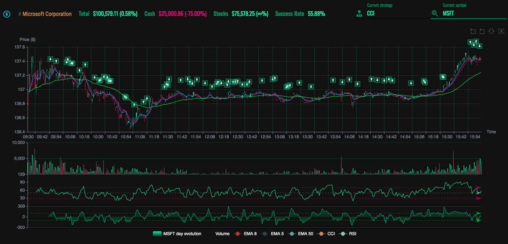

# BacktestApp

This project is an effort to create an ad-hoc stock backtesting software.
It allows the user to compare different strategies over different symbols from the NYSE.

## Requirements

For the frontend to be able to fetch financial market data, you will have to get the websocket server counterpart running (see server directory) first.

## Installation

Proceed with the installation of all the dependencies by typing `npm install`.

To run the project, type `npm start`.

## Development server

Run `ng serve` for a dev server. Navigate to `http://localhost:4200/`. The app will automatically reload if you change any of the source files.

## Build

Run `ng build` to build the project. The build artifacts will be stored in the `dist/` directory. Use the `--prod` flag for a production build.
